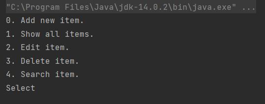
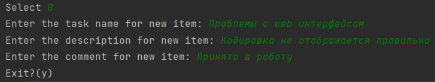
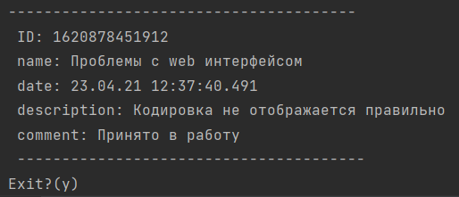
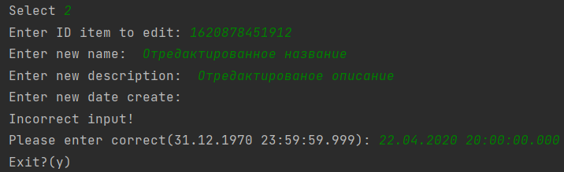
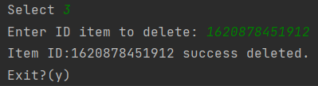
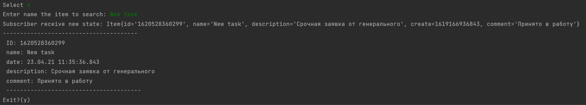
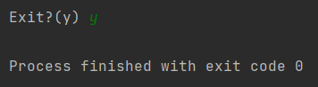

[](https://www.travis-ci.com/RomanRusanov/Tracker)
[](https://codecov.io/gh/RomanRusanov/Tracker)
# Tracker

Это простое консольное приложение позволяющее создавать и регистрировать заявку в системе.

Приложение прошло несколько этапов и были добавлены:
*   интерфейс для тестирования консольного ввода ```src/main/java/ru/rrusanov/StubInput.java```
*   валидация данных введенных пользователем ```src/main/java/ru/rrusanov/ValidateInput.java```
*   реализация с хранением в БД ```src/main/java/ru/rrusanov/TrackerSQL.java```
*   реализация connection c откатом транзакции для тестирования с использованием реальной бд ```src/main/java/ru/rrusanov/ConnectionRollback.java```
*   реализация с использованием ORM Hibernate ```src/main/java/ru/rrusanov/hibernate```
*   реализация шаблона Наблюдатель получение данных в реактивном стиле

### ScreenShot

Основное меню



0. Добавление новой заявки
   
   
   
1. Отобразить все заявки
   
   

2. Редактировать заявку
   
   
   
3. Удаление заявки
   
   

4. Поиск заявки
   
   
   
выход если ввести "y" в основном меню или после любой операции



# Конфигурирование:

*   Для использования версии с бд native необходима заполнить (пользователя, пароль и имя бд)```src/main/resources/app.properties```
схема бд будет создана при помощи liquibase
*   Версия с hibernate также нуждается в указании пользователя, пароля и имя бд. Схему создаст сам hibernate. ```src/main/resources/hibernate.cfg.xml```

##Контакты:
*   skype: rusanov_roman
*   telegram: @Roman_Rusanov